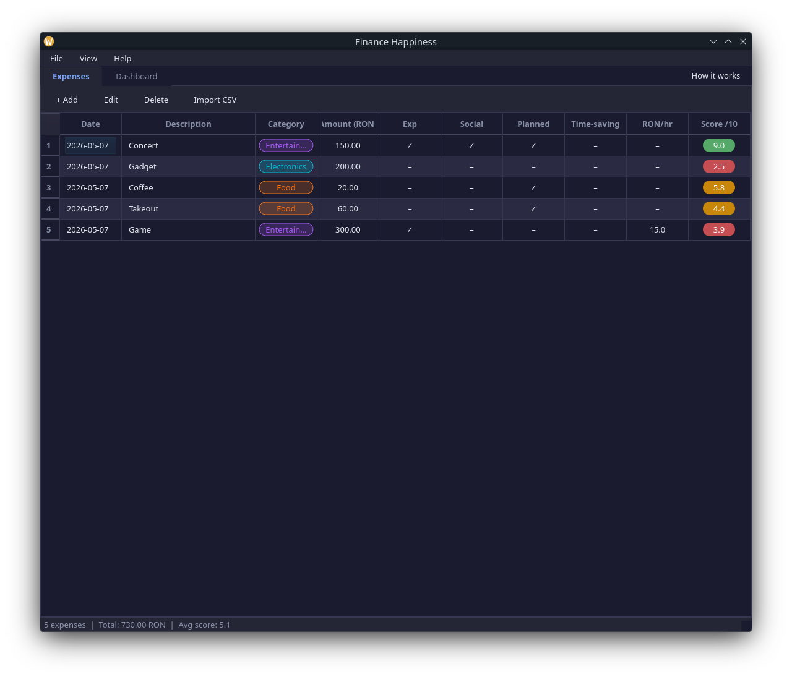

# Finance Happiness

A desktop personal finance manager that scores each purchase 0–10 based on findings from behavioral economics research. Instead of just showing *how much* you spend, it shows *how well* you spend.



## What it does

- Log expenses with amount, category, date and description
- Tag each purchase with behavioral attributes (experiential/material, social/solo, planned/impulse, time-saving)
- Calculates a happiness score per expense using a multi-factor algorithm
- Dashboard with spending breakdown, happiness score by category, score over time, and cost-efficiency charts
- CSV import with preview dialog
- Light and dark theme

## Happiness Score

The score is calculated from four factors multiplied together and scaled to 0–10:

1. **Tag multipliers** — experiential (+30%), social (+20%), planned (+15%), time-saving (+20%), impulse penalty (−10%) — based on Van Boven & Gilovich (2003), Dunn et al. (2008), Whillans et al. (2017)
2. **Diminishing returns** — logarithmic decay on cumulative category spend — based on Kahneman & Deaton (2010)
3. **Hedonic adaptation** — −10% per repeat purchase in same category within 30 days, floor 60% — based on Brickman & Campbell (1971)
4. **Perceived value** (optional) — transaction utility modifier from "great deal" to "luxury splurge", with guilt penalty on unplanned expensive purchases — based on Thaler (1985)

## Tech stack

- Python 3.11+
- PyQt6
- SQLite
- pandas
- matplotlib

## Running the app

```bash
python -m venv .venv
source .venv/bin/activate.fish   # or activate for bash/zsh
pip install -e ".[dev]"
python -m finance_happiness.main
```

## Running tests

```bash
pytest tests/ -v
```

68 tests across scoring, models, database, analytics and CSV import.

## Documentation

Full project documentation is available in Romanian and submitted separately.
