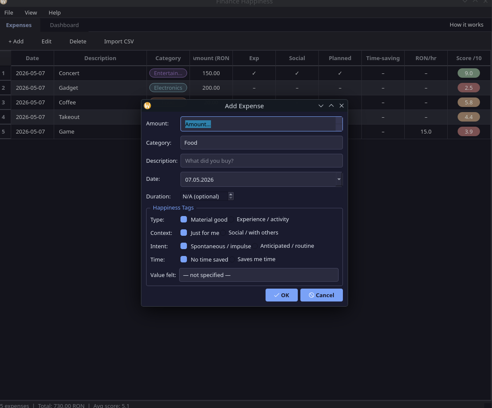
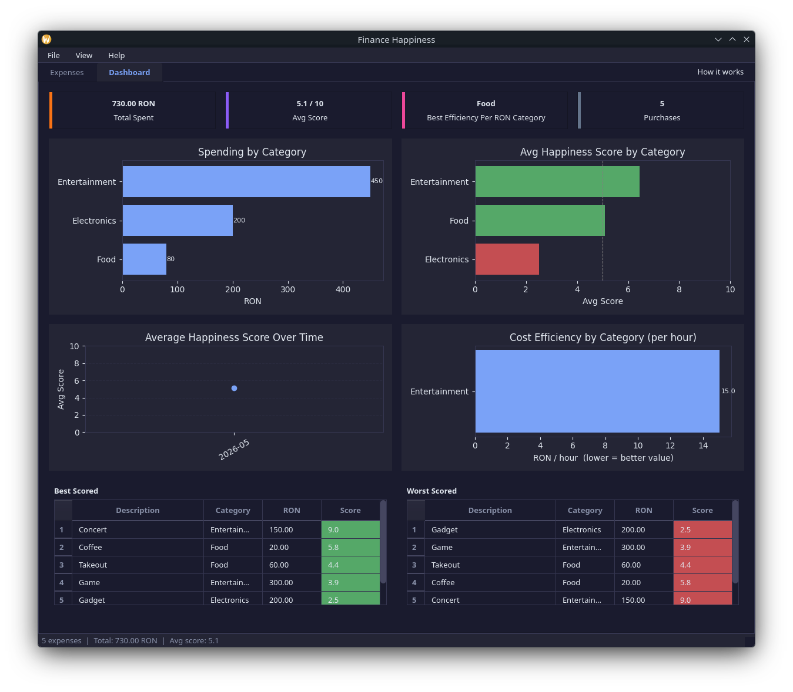
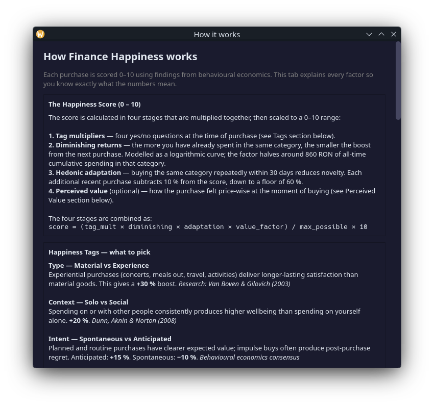
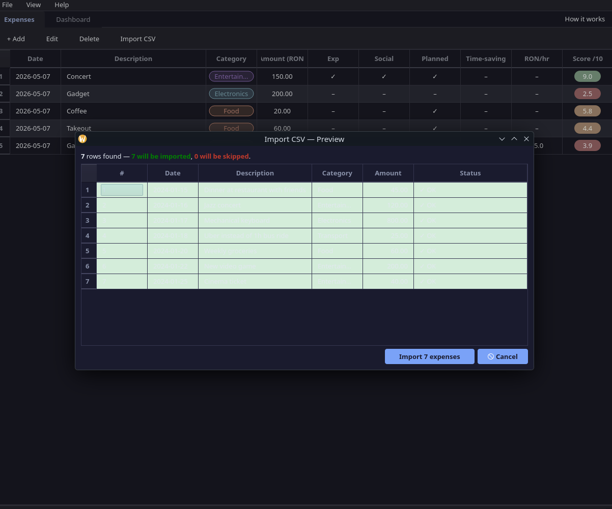
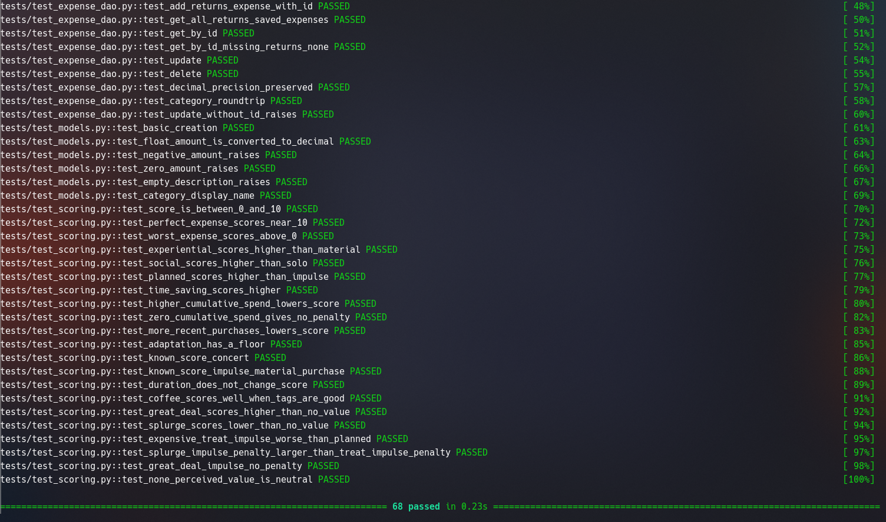

<div align="center">

# Proiect de absolvire curs Programator Ajutor

## Finance Happiness
### Aplicație de gestiune financiară personală cu analiză bazată pe fericire

</div>

<br><br><br><br><br><br>

<div align="right">

Istrate Rares Petrisor

</div>

---

## Cuprins

1. [Introducere](#1-introducere)
2. [Motivația proiectului](#2-motivația-proiectului)
3. [Fundamente teoretice](#3-fundamente-teoretice)
4. [Arhitectura aplicației](#4-arhitectura-aplicației)
5. [Modelul de date](#5-modelul-de-date)
6. [Algoritmul de scoring al fericirii](#6-algoritmul-de-scoring-al-fericirii)
7. [Interfața grafică](#7-interfața-grafică)
8. [Importul datelor din CSV](#8-importul-datelor-din-csv)
9. [Testarea aplicației](#9-testarea-aplicației)
10. [Concluzii și perspective](#10-concluzii-și-perspective)
11. [Bibliografie](#11-bibliografie)

---

## 1. Introducere

Finance Happiness este o aplicație desktop de gestiune a cheltuielilor personale, construită în Python cu interfață grafică PyQt6. Diferența față de un tracker clasic de buget: în loc să arate doar *cât* ai cheltuit, aplicația calculează pentru fiecare achiziție un scor de fericire de la 0 la 10, bazat pe concluzii din cercetarea în economie comportamentală și psihologia bunăstării.

Ideea centrală este că suma cheltuită și fericirea produsă nu sunt corelate direct. O ieșire la concert de 150 RON poate aduce o satisfacție mult mai mare decât un gadget de 300 RON cumpărat impulsiv. Aplicația face această diferență vizibilă și măsurabilă.

---

## 2. Motivația proiectului

Punctul de plecare a fost o observație simplă: la finalul lunii, privind extrasul de cont, unele cheltuieli par să fi meritat și altele nu — fără să poți explica exact de ce. Aplicațiile existente de buget arată totaluri și grafice, dar tratează toate cheltuielile identic din punct de vedere calitativ.

Căutând o metodă mai riguroasă de a gândi la cheltuieli, am găsit mai multe studii din psihologia fericirii care răspund exact la această întrebare. Cercetătorii au demonstrat că anumite tipuri de cheltuieli produc în mod constant o bunăstare mai mare decât altele, indiferent de sumă. Aceste concluzii sunt cunoscute în mediul academic, dar nu se regăsesc în nicio aplicație practică de uz zilnic.

Finance Happiness pune aceste concluzii într-un instrument concret, care transformă deciziile financiare dintr-un exercițiu pur numeric într-unul calitativ.

---

## 3. Fundamente teoretice

Algoritmul de scoring se bazează pe șase direcții de cercetare. Fiecare contribuie cu un factor distinct la formula finală.

### 3.1 Cheltuieli experiențiale versus materiale

Van Boven și Gilovich (2003) au demonstrat că achizițiile experiențiale — concerte, vacanțe, mese în oraș, activități — produc o satisfacție mai ridicată și mai durabilă decât achizițiile materiale de valoare echivalentă. Explicația: o experiență trăită devine parte din identitatea noastră și nu poate fi comparată sau devalorizată; un obiect material rămâne extern și se uzează fizic și emoțional. Aplicația aplică un coeficient de **+30%** pentru achizițiile marcate ca experiențiale.

### 3.2 Randamentele descrescătoare

Kahneman și Deaton (2010) au arătat că relația dintre cheltuieli și bunăstare nu este liniară. Dincolo de un anumit nivel de consum într-o categorie, fiecare leu suplimentar aduce tot mai puțin emoțional — a cincea pereche de pantofi nu aduce aceeași bucurie ca prima. Aplicația modelează acest principiu printr-o funcție logaritmică aplicată cheltuielilor cumulate per categorie.

### 3.3 Adaptarea hedonică

Brickman și Campbell (1971) au introdus conceptul de „bandă rulantă hedonică": oamenii se adaptează rapid la experiențe noi și revin la un nivel de bază al fericirii. Concret, cu cât cumperi mai des din aceeași categorie, cu atât noutatea scade. Aplicația penalizează achizițiile repetate în aceeași categorie în ultimele 30 de zile.

### 3.4 Cheltuielile sociale

Dunn, Aknin și Norton (2008) au demonstrat, într-un studiu pe participanți din mai multe țări și niveluri de venit, că a cheltui bani *pentru* sau *cu* alte persoane aduce o satisfacție mai mare decât a cheltui exclusiv pe sine. Efectul se menține indiferent de nivelul de venit. Aplicația aplică un coeficient de **+20%** pentru achizițiile marcate ca sociale.

### 3.5 Cumpărarea timpului

Whillans și colaboratorii (2017) au arătat că persoanele care cheltuiesc bani pentru a economisi timp — livrare, transport, servicii de curățenie — raportează un nivel de fericire zilnică mai ridicat decât cele care nu o fac, chiar la venituri similare. Mecanismul este reducerea stresului legat de lipsa de timp, nu neapărat câștigul de ore în sine. Aplicația aplică un bonus de **+20%** pentru achizițiile care economisesc timp.

### 3.6 Utilitatea tranzacțională

Richard Thaler (1985) a introdus conceptul de *transaction utility*: satisfacția sau disconfortul care vine nu din obiectul cumpărat, ci din percepția prețului față de un preț de referință. Un lucru cumpărat la chilipir produce satisfacție suplimentară; o achiziție impulsivă percepută ca scumpă generează vinovăție post-cumpărare. Aplicația implementează acest mecanism printr-un câmp opțional de „valoare percepută" cu cinci niveluri, cu penalizare suplimentară de vinovăție aplicată doar dacă achiziția a fost și impulsivă.

---

## 4. Arhitectura aplicației

### 4.1 Structura proiectului

```
finance-happiness/
├── src/
│   └── finance_happiness/
│       ├── models/          # structuri de date pure
│       ├── database/        # acces la SQLite
│       ├── scoring/         # algoritmul de scoring
│       ├── analytics/       # agregări pandas, import CSV
│       ├── ui/              # interfața PyQt6
│       └── resources/       # stiluri QSS
├── tests/
├── data/
│   └── sample_expenses.csv
└── pyproject.toml
```

Proiectul folosește structura `src layout` recomandată de PEP 517/518, care forțează instalarea pachetului înainte de utilizare și elimină o clasă întreagă de erori de import silențioase (când Python găsește codul direct pe disk, nu prin pachetul instalat).

### 4.2 De ce am separat codul în module distincte

Separarea nu este decorativă — are un scop concret: **modulul de scoring nu știe că există o interfață grafică, iar interfața nu accesează direct baza de date**.

Consecințele practice:
- Formula de scoring poate fi modificată sau înlocuită fără să se atingă un singur rând din codul UI
- Testele pentru scoring și DAO rulează fără să pornească aplicația grafică
- Baza de date ar putea fi înlocuită cu alt motor de stocare fără ca restul aplicației să observe

Fără această separare, o modificare a algoritmului ar implica deschiderea fișierelor de interfață și invers — exact genul de cuplaj care face codul greu de modificat și greu de testat.

### 4.3 Tehnologii utilizate și motivele alegerii

| Componentă | Tehnologie | De ce această alegere |
|---|---|---|
| Interfață grafică | PyQt6 | Toolkit matur, cross-platform, cu suport nativ pentru teme QSS și delegate-uri de randare personalizate — funcționalități absente din tkinter |
| Bază de date | SQLite (stdlib) | Fără server, fără dependențe externe, fișier local portabil; permite interogări SQL complexe spre deosebire de JSON sau CSV |
| Analiză date | pandas | Agregările necesare (group by categorie, medii, ranking) se scriu în 1-2 linii; echivalentul în Python pur ar fi cod repetitiv și fragil |
| Vizualizare | matplotlib | Integrare nativă cu Qt prin `FigureCanvasQTAgg`; graficele se renderează direct în fereastră fără un browser sau server separat |
| Sume monetare | `decimal.Decimal` | `float` nu poate reprezenta exact valori zecimale (ex: `0.1 + 0.2 ≠ 0.3`); pentru bani, erorile de rotunjire sunt inacceptabile |

### 4.4 Fluxul datelor la adăugarea unei cheltuieli

Când utilizatorul completează formularul și apasă OK, aplicația urmează pașii:

1. UI construiește un obiect `Expense` din valorile formularului
2. DAO salvează obiectul în SQLite și returnează ID-ul generat
3. Calculatorul interogează baza de date pentru cheltuielile anterioare din aceeași categorie (pentru diminishing returns) și numărul de achiziții recente (pentru hedonic adaptation)
4. Scorul calculat este scris înapoi în baza de date prin DAO
5. Tabelul UI se reîncarcă

Scorul este recalculat și la editare, deoarece modificarea datei sau a tagurilor poate schimba contextul istoric.

---

## 5. Modelul de date

### 5.1 Entitatea Expense

Cheltuiala este reprezentată ca `dataclass` Python:

```python
@dataclass
class Expense:
    amount: Decimal
    category: Category
    description: str
    date: date
    experiential: bool
    social: bool
    planned: bool
    time_saving: bool
    id: int | None = None
    happiness_score: float | None = None
    duration_minutes: int | None = None
    perceived_value: PerceivedValue | None = None
```

Am ales `dataclass` față de o clasă obișnuită deoarece generează automat `__init__`, `__repr__` și `__eq__` din declarațiile de câmpuri, eliminând cod repetitiv. Validarea se face în `__post_init__`: suma trebuie să fie strict pozitivă, descrierea nu poate fi goală, durata (dacă e specificată) trebuie să fie pozitivă. Conversia automată `float → Decimal` este implementată tot aici, pentru a accepta valori float fără a pierde precizia la stocare.

Câmpurile `duration_minutes` și `perceived_value` sunt opționale (`None` by default) deoarece nu orice cheltuială are durată măsurabilă și nu toți utilizatorii vor completa percepția de preț. Absența lor nu afectează calculul scorului de bază.

### 5.2 Categorii și percepție de valoare

Categoriile și percepția de valoare sunt definite ca `Enum`:

```python
class Category(Enum):
    FOOD = "Food"
    TRANSPORT = "Transport"
    ENTERTAINMENT = "Entertainment"
    ELECTRONICS = "Electronics"
    HEALTH = "Health"
    EDUCATION = "Education"
    CLOTHING = "Clothing"
    OTHER = "Other"
```

În baza de date se stochează **numele enum-ului** (`FOOD`, `ENTERTAINMENT` etc.), nu valoarea de afișare (`Food`, `Entertainment`). Motivul: dacă valorile de afișare se schimbă în viitor (traducere, rebranding), datele existente rămân valide fără nicio migrație.

### 5.3 Schema bazei de date

```sql
CREATE TABLE IF NOT EXISTS expenses (
    id               INTEGER PRIMARY KEY AUTOINCREMENT,
    amount           TEXT    NOT NULL,
    category         TEXT    NOT NULL,
    description      TEXT    NOT NULL,
    date             TEXT    NOT NULL,
    experiential     INTEGER NOT NULL,
    social           INTEGER NOT NULL,
    planned          INTEGER NOT NULL,
    time_saving      INTEGER NOT NULL,
    happiness_score  REAL,
    duration_minutes INTEGER,
    perceived_value  TEXT
);
```

Câteva decizii de stocare care merită explicație:

- **`amount` ca TEXT**: SQLite nu are tip `DECIMAL`. Stocarea ca `REAL` (float) ar introduce erori de precizie. Stocarea ca text a valorii exacte (`"212.50"`) și reconversia la `Decimal` la citire păstrează precizia intactă.
- **Booleane ca INTEGER**: SQLite nu are tip boolean nativ; 0 și 1 sunt standardul.
- **`date` ca TEXT ISO 8601**: formatul `YYYY-MM-DD` se sortează corect ca string, fără conversie la tip DATE.

Coloanele adăugate ulterior (`duration_minutes`, `perceived_value`) sunt gestionate printr-un mecanism de migrație la pornire: aplicația încearcă să adauge fiecare coloană și ignoră eroarea dacă există deja. Bazele de date create cu versiuni mai vechi continuă să funcționeze fără intervenție manuală.

---

## 6. Algoritmul de scoring al fericirii

Scorul final este un număr real în intervalul [0, 10], obținut din patru factori multiplicativi scalați la urmă.

### 6.1 Etapa 1 — Multiplicatorii din taguri

Fiecare din cele patru caracteristici ale achiziției aplică un coeficient independent:

| Tag | True | False |
|---|---|---|
| Experiențial | × 1,30 | × 1,00 |
| Social | × 1,20 | × 1,00 |
| Planificat | × 1,15 | × 0,90 (penalizare impuls) |
| Economisește timp | × 1,20 | × 1,00 |

Maximul teoretic — toate tagurile active — este 1,30 × 1,20 × 1,15 × 1,20 = **2,1528**. Această valoare devine numitorul la scalare, garantând că scorul maxim posibil este exact 10.

Penalizarea pentru impuls (× 0,90) este mai mică în valoare absolută decât bonusul pentru planificare (× 1,15) deoarece literatura indică un impact negativ al regretului post-cumpărare mai slab decât impactul pozitiv al anticipării.

### 6.2 Etapa 2 — Randamente descrescătoare

```
diminuare = 1 / (1 + ln(1 + cheltuieli_cumulate_categorie / 500))
```

Factorul pornește de la 1,0 (fără penalizare) și scade logaritmic pe măsură ce cheltuielile cumulate în aceeași categorie cresc. La 500 RON cumulați factorul este ≈ 0,59; la 860 RON scade la 0,5; la 2.000 RON ajunge la ≈ 0,38. Nu atinge niciodată zero.

Valoarea de referință 500 RON a fost aleasă ca prag rezonabil pentru piața românească — nivelul la care un utilizator tipic a cheltuit suficient într-o categorie încât randamentele să înceapă să scadă vizibil.

### 6.3 Etapa 3 — Adaptare hedonică

```
adaptare = max(0,60 ;  1,0 − număr_achiziții_recente_30_zile × 0,10)
```

Se numără câte achiziții din aceeași categorie au fost înregistrate în ultimele 30 de zile înainte de achiziția curentă. Fiecare reduce scorul cu 10%, cu un minim de 60%. Fereastra de 30 de zile se calculează față de data achiziției, nu față de data curentă — astfel istoricul rămâne corect chiar dacă backdatezi sau editezi o cheltuială.

Pragul de 60% reflectă că un obicei repetitiv nu devine lipsit de valoare — o cafea zilnică poate fi un ritual plăcut; nu merită să primească scor zero.

### 6.4 Etapa 4 — Valoarea percepută (opțional)

Câmpul „Value felt" din formular implementează utilitatea tranzacțională a lui Thaler. Dacă este lăsat necompletat, factorul este 1,0 și nu influențează scorul.

| Percepție | Modificator | Penalizare vinovăție (doar dacă impulsiv) |
|---|---|---|
| Chilipir | 1,20 | 0,00 |
| Preț corect | 1,08 | 0,00 |
| Preț normal | 1,00 | 0,00 |
| Tratament scump | 0,92 | − 0,12 |
| Lux / moft | 0,80 | − 0,20 |

Penalizarea de vinovăție se aplică **numai** dacă achiziția a fost și impulsivă. O achiziție de lux pentru care te-ai pregătit și economisit are un profil psihologic complet diferit față de același produs cumpărat pe loc.

### 6.5 Formula finală și exemplu concret

```
scor_brut  = multiplicator_taguri × diminuare × adaptare × factor_valoare
scor_final = (scor_brut / 2,1528) × 10
scor_final = max(0,0 ; min(10,0 ; scor_final))
```

**Exemplu:** bilete la concert, 150 RON — experiențial, social, planificat, fără economisire de timp, prima achiziție la Entertainment, preț considerat corect:

```
multiplicator = 1,30 × 1,20 × 1,15 × 1,00 = 1,794
diminuare     = 1,0   (fără cheltuieli anterioare la Entertainment)
adaptare      = 1,0   (fără achiziții recente)
valoare       = 1,08  (Fair price)
scor_brut     = 1,794 × 1,0 × 1,0 × 1,08 = 1,9375
scor_final    = (1,9375 / 2,1528) × 10 ≈ 9,0
```

**Contra-exemplu:** gadget electronic, 200 RON — material, solo, impulsiv, fără economisire de timp, perceput ca lux:

```
multiplicator = 1,00 × 1,00 × 0,90 × 1,00 = 0,90
valoare       = 0,80 − 0,20 = 0,60  (lux + penalizare impuls)
scor_final    = (0,90 × 0,60 / 2,1528) × 10 ≈ 2,5
```

Aceleași sume de bani, satisfacție estimată de 3,6 ori mai mare pentru concert.

---

## 7. Interfața grafică


Interfața folosește o fereastră principală (`QMainWindow`) cu două tab-uri — Expenses și Dashboard — și un buton de acces rapid la documentația internă.

### 7.1 Tab-ul Expenses

Tabelul principal are 10 coloane: data, descrierea, categoria, suma, cei patru indicatori booleeni (✓ sau –), eficiența RON/oră și scorul de fericire.

Coloana **Category** și coloana **Score** folosesc delegate-uri personalizate (`QStyledItemDelegate`) care desenează elementele ca chip-uri și pastile rotunjite colorate, în loc de text simplu. Am ales această abordare față de o coloană de text obișnuită deoarece datele dintr-un tabel cu 10 coloane se citesc mai rapid prin semnale vizuale decât prin text — utilizatorul identifică imediat categoria și calitatea scorului fără să citească fiecare valoare. Culorile scorului: verde ≥ 7,0, chihlimbar ≥ 4,0, roșu < 4,0.

### 7.2 Formularul de cheltuială



Formularul are două secțiuni: datele de bază (sumă, categorie, descriere, dată, durată opțională) și tagurile de fericire.

Tagurile sunt prezentate ca **perechi de butoane radio** în loc de checkbox-uri clasice. Motivul: un checkbox „Planificat" bифat înseamnă planificat, nebifat înseamnă... ce? Neplanificat sau neprecizat? Perechea „Spontan / impulsiv" — „Anticipat / rutină" elimină ambiguitatea și face clar că utilizatorul alege între două variante explicite.

Câmpul de durată afișează în timp real echivalentul în ore (ex: `120 min → ≈ 2,0 h`), util pentru a evalua imediat eficiența cost/timp fără calcul manual.

### 7.3 Tab-ul Dashboard



Dashboard-ul conține patru carduri statistice și patru grafice matplotlib:

- **Cheltuieli per categorie** — bare orizontale cu totalul RON per categorie
- **Scor mediu per categorie** — bare colorate verde (≥ 5,0) sau roșu (< 5,0), cu o linie de referință la 5,0
- **Evoluția scorului în timp** — media lunară pe grafic liniar
- **Eficiență cost/oră per categorie** — RON/oră mediu, calculat doar din achizițiile cu durată specificată; mai mic înseamnă valoare mai bună per oră

Sub grafice, două tabele compacte arată top 5 cele mai bune și cele mai slabe achiziții după scor.

Graficele matplotlib sunt tematizate dinamic — culorile de fundal, text și bare se adaptează la tema deschisă/închisă activă.

### 7.4 Tema vizuală

Aplicația suportă temă deschisă și închisă, definite ca fișiere QSS (CSS pentru Qt). La prima pornire, detectează automat preferința sistemului prin API-ul Qt 6.5+. Preferința selectată manual se salvează prin `QSettings` și se restaurează la reporniri ulterioare.

### 7.5 Documentația internă



Butonul „How it works" din colțul ferestrei deschide un dialog care explică fiecare factor al algoritmului, valorile concrete ale curbelor, ghidul de completare a tagurilor și formatul CSV acceptat — toate verificate față de codul sursă.

---

## 8. Importul datelor din CSV

Aplicația acceptă fișiere CSV pentru a facilita importul din exporturi bancare sau foi de calcul existente.

### 8.1 Coloanele acceptate

Singurele câmpuri obligatorii sunt `amount`, `description` și `date`. Restul sunt opționale:

| Coloană | Obligatoriu | Note |
|---|---|---|
| amount | Da | Sumele negative (debite bancare) sunt convertite automat la pozitiv |
| description | Da | — |
| date | Da | Formate acceptate: YYYY-MM-DD, DD/MM/YYYY, MM/DD/YYYY, DD.MM.YYYY |
| category | Nu | Default: OTHER dacă lipsește sau nu este recunoscută |
| experiential, social, planned, time_saving | Nu | Valori: true/false, 1/0, yes/no |
| duration_minutes | Nu | Număr întreg pozitiv |
| perceived_value | Nu | Numele enum-ului sau valoarea de afișare (case-insensitiv) |

### 8.2 Dialogul de previzualizare



Înainte de import, aplicația afișează un dialog de previzualizare care listează fiecare rând din fișier cu statusul său: verde pentru rândurile valide, roșu pentru cele cu erori, cu descrierea erorii. Utilizatorul poate confirma importul rândurilor valide sau poate anula.

Rândurile invalide nu blochează importul celorlalte — parserul procesează fiecare rând independent. Aceasta permite importul parțial dintr-un fișier bancar cu formate mixte sau câmpuri lipsă.

---

## 9. Testarea aplicației

### 9.1 Strategia de testare

Aplicația are **68 de teste automate** organizate în cinci fișiere, câte unul per modul cu logică testabilă. Interfața grafică nu este testată automat — testarea widget-urilor Qt necesită un display activ; validarea UI s-a făcut manual.

Testele rulează cu `pytest` și nu depind de mediu: baza de date folosește SQLite **în memorie** (`:memory:`), astfel că fiecare test pornește cu o stare curată fără fișiere temporare sau dependențe de ordine de execuție.

### 9.2 Acoperirea pe module

| Modul | Teste | Ce verifică |
|---|---|---|
| `models/` | 7 | Validarea câmpurilor, conversia float → Decimal, valorile enumerărilor |
| `database/expense_dao.py` | 9 | CRUD complet, precizie zecimală la roundtrip, migrații de schemă |
| `analytics/csv_importer.py` | 12 | Formate de dată, sume negative, categorii necunoscute, rânduri invalide |
| `analytics/aggregator.py` | 20 | Agregări pandas, calcule RON/oră, ranking top/bottom |
| `scoring/calculator.py` | 20 | Formula completă, fiecare factor individual, valori concrete |

### 9.3 Exemple reprezentative

Testele de scoring nu verifică doar că rezultatele sunt în [0, 10], ci că **relațiile dintre factori respectă teoria**:

```python
def test_experiential_scores_higher_than_material():
    base = dict(social=False, planned=True, time_saving=False)
    experiential = calculate_score(make_expense(experiential=True,  **base), Decimal("0"), 0)
    material     = calculate_score(make_expense(experiential=False, **base), Decimal("0"), 0)
    assert experiential > material
```

Un test important verifică o decizie de design: durata nu influențează scorul de fericire, ci doar metrica separată RON/oră:

```python
def test_duration_does_not_change_score():
    film = make_expense(duration_minutes=90)
    game = make_expense(duration_minutes=6000)
    none = make_expense(duration_minutes=None)
    assert calculate_score(film, Decimal("0"), 0) \
        == calculate_score(game, Decimal("0"), 0) \
        == calculate_score(none, Decimal("0"), 0)
```

Fără acest test, o modificare accidentală a formulei ar fi trecut neobservată.

Testele pentru valoarea percepută verifică și interacțiunea cu factorul de impulsivitate:

```python
def test_expensive_treat_impulse_worse_than_planned():
    planned = make_expense(planned=True,  perceived_value=PerceivedValue.EXPENSIVE_TREAT)
    impulse = make_expense(planned=False, perceived_value=PerceivedValue.EXPENSIVE_TREAT)
    assert calculate_score(planned, Decimal("0"), 0) > calculate_score(impulse, Decimal("0"), 0)
```

### 9.4 Rezultatele testelor



---

## 10. Concluzii și perspective

### 10.1 Ce s-a realizat

Aplicația Finance Happiness funcționează conform obiectivului inițial: oferă un instrument care combină urmărirea cheltuielilor cu o evaluare calitativă bazată pe cercetare. Scorul de fericire este calculat în timp real la fiecare adăugare sau editare, dashboardul arată distribuția calității cheltuielilor per categorie, iar importul CSV permite aducerea datelor existente fără introducere manuală.

Din punct de vedere tehnic, proiectul acoperă: arhitectură stratificată cu separare clară a responsabilităților, acces la baze de date relaționale cu migrații, interfață grafică completă cu teme și randare personalizată, analiză de date cu pandas, vizualizare cu matplotlib și o suită de teste automate pe toate nivelurile de logică.

### 10.2 Ce am învățat

Cel mai concret lucru pe care l-am înțeles în cursul acestui proiect este importanța separării responsabilităților — nu ca principiu abstract, ci ca decizie practică cu consecințe directe. Când am vrut să adaug factorul de valoare percepută (Thaler) la formula de scoring, modificarea a constat în câteva linii în `scoring/calculator.py` și câteva câmpuri în formular — fără să atingă baza de date, dashboard-ul sau logica de import. Fără separare, aceeași modificare ar fi implicat intervenții în 5-6 fișiere cu risc de regresii.

Un alt lucru concret: testele scrise înainte de a fi nevoie de ele au prins erori pe care nu le-aș fi observat altfel. Testul care verifică că durata nu influențează scorul a identificat o problemă de design în primele iterații ale formulei, înainte ca aceasta să ajungă în UI.

### 10.3 Perspective de dezvoltare

- **Export PDF** — raport lunar cu grafice, util pentru retrospective financiare periodice
- **Obiective financiare** — buget per categorie cu urmărirea progresului
- **Notificări** — alertă când scorul mediu lunar scade sub un prag stabilit de utilizator
- **Sincronizare bancară** — import automat din extrase OFX/QIF, eliminând introducerea manuală

---

## 11. Bibliografie

1. Van Boven, L., & Gilovich, T. (2003). *To do or to have? That is the question.* Journal of Personality and Social Psychology, 85(6), 1193–1202.

2. Kahneman, D., & Deaton, A. (2010). *High income improves evaluation of life but not emotional well-being.* Proceedings of the National Academy of Sciences, 107(38), 16489–16493.

3. Dunn, E. W., Aknin, L. B., & Norton, M. I. (2008). *Spending money on others promotes happiness.* Science, 319(5870), 1687–1688.

4. Whillans, A. V., Dunn, E. W., Smeets, P., Bekkers, R., & Norton, M. I. (2017). *Buying time promotes happiness.* Proceedings of the National Academy of Sciences, 114(32), 8523–8527.

5. Thaler, R. H. (1985). *Mental accounting and consumer choice.* Marketing Science, 4(3), 199–214.

6. Brickman, P., & Campbell, D. T. (1971). *Hedonic relativism and planning the good society.* In M. H. Appley (Ed.), Adaptation-level theory (pp. 287–302). Academic Press.

7. Python Software Foundation. (2024). *Python 3.11 Documentation.* https://docs.python.org/3.11/

8. Riverbank Computing. (2024). *PyQt6 Reference Guide.* https://www.riverbankcomputing.com/static/Docs/PyQt6/
